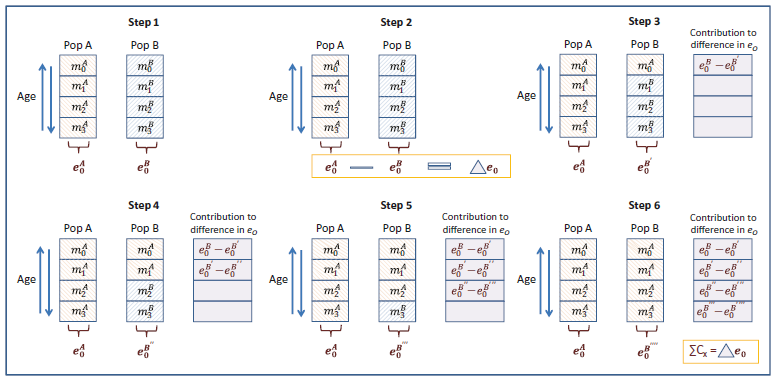

<h3><b>1 Data description and availability</b></h3>

To compute the disability-free life expectancy (DFLE) indicator, data on both mortality and morbidity (disability) are needed. 

<h4><b>1.1 Mortality data</b></h4>

This study draws on census-linked mortality data by five-year age classes, gender, educational attainment, and region of residence for Italy. These data have been released by the Italian National Institute of Statistics (Istat) in 2018 and are open access (https://www.istat.it/it/archivio/212512). Data from the 15th Census of Population and Housing of 2011 have been linked with mortality and migration records of the following 3 years (2012, 2013, 2014). As reported in the corresponding methodological note, the computation of mortality rates has been differentiated into three age groups: 1-29 years, 30-89 years and 90 years and older. For the first age group, the rates were calculated by gender, five-year age intervals and geographical areas of residence. In addition, in the intermediate age group, the levels of education were considered. Finally, from the age 90, rates were calculated by gender, geographical areas of residence and single ages, using the Kannisto model (Kannisto 1994). The educational groups (<i>low, medium and high</i>) are classified based on the highest educational attainment achieved: taking into account the age groups in analysis, <i>low</i> indicates primary school diploma or less, <i>mid</i> indicates lower secondary school diploma, <i>high</i> indicates upper secondary school diploma or more. 

<h4><b>1.2 Morbidity data</b></h4>

The morbidity data are based on disability prevalence by age, gender, educational attainment and region of residence for Italian older adults (aged 65 and older), derived from the Italian survey <i>Aspects of daily living</i> (https://www.istat.it/it/archivio/4630) of 2012, 2013, 2014. These data, at single-age detail, are available upon personal request from Istat contact centre website (https://contact.istat.it/). Disability is operationalized by one of the Minimum European Health Module (MEHM) questions, measuring the Global Activity Limitation Indicator (GALI) (Robine et al. 2003). It expresses the self-reported health-related long-term limitations on daily activities and it is based on the single-item survey question: <i>For at least the past six months, to what extent have you been limited because of a health problem in activities people usually do? Would you say you have been:</i> with three possible answers: <i>severely limited</i>; <i>limited but not severely</i>; <i>not limited at all</i>. The educational attainment has been classified into the same three categories, <i>low, medium and high</i>, used for its classification in mortality data. To have more robust estimations, prevalence are calculated by averaging on the three years (2012-2014), properly considering the sample weights. Due to the high level of detail of our analysis, some assumptions to deal with missing strata are made: Piemonte and Valle d'Aosta, Molise and Abruzzo, Basilicata and Puglia regions and Trento and Bolzano autonomous provinces, have, in pairs, the same health prevalence. The analytical sample of this study includes 30738 individuals, pooled over the three years, aged 65 years and older living in households (thus, the individuals living in institutions are not considered). Individuals underwent a paper-and-pencil-interview and provided information on their gender, region of residence, level of education, and disability status.

<h3><b>2 Methods</h3>

<h4>2.1 Sullivan method</b></h4>

We apply the Sullivan method (Sullivan 1971) to calculate the DFLE at age 65 by gender, level of education and region of residence in Italy.

First, we compute the age-specific prevalence of disability-free individuals $\pi_{x}$ (those declaring having no limitations) in each strata. Second, we apply this age-specific prevalence $\pi_{x}$ to the age-specific person-years lived $L_{x}$ from the life tables, specifying the person-years lived disability-free $L_{x}^{i}$.

\(L_{x}^{i} = \pi_{x}*L_{x}\)

Finally, we sum these quantities for the ages above 65 and divide them by the lifetable survivors at age 65 $l_{65}$.

\(DFLE_{65} = \frac{\sum_{x=65}^{85+}
L_{x}^{i}}{l_{65}}\)

DFLE, computed as described above, measures the average number of years that a hypothetical cohort of individuals can expect to live free from disability, if they experience the mortality and disability conditions observed in year under study.

The confidence intervals $CI(DFLE_{65})$ are also computed and are based on the age-specific variance of prevalence $Var(\pi_{x}^{i})$, calculated using the unweighted number of respondents in each strata $N_{x}^{i}$

\(Var(\pi_{x}^{i}) = \frac{\pi_{x}^{i}*(1-\pi_{x}^{i})}{N_{x}^{i}} \)

\(Var(DFLE_{65}) = \frac{\sum_{x=65}^{85+}
L_{x}^i{}^2*Var(\pi_{x}^{i})}{l_{65}^{2}}\)

\(CI(DFLE_{65}) = DFLE_{65}\pm1.96*\sqrt{Var(DFLE_{65})}\)

A detailed discussion of Sullivan's method and its assumptions is given by Imai and Soneji (2007).

<h4><b>2.2 Stepwise decomposition method</b></h4>

The parameters used for computing DFLE are the age-specific mortality rates $m_{x}$ and disability prevalence $\pi_{x}$. Using decomposition methods, it is possible to attribute the difference in DFLE between two groups (e.g. by gender or education) into the contributions of the age-specific parameters.

In this study we use the Step-wise decomposition method, first described by Andreev (2002) and formally described also by Jdanov et al. (2017). The method consist in altering the parameters one element at a time by exchanging the parameter between the groups, for each age class. After each alteration, the indicator is recomputed and the contribution of the change of the age-specific parameter is estimated.

In particular, if $DFLE_{x}$ in the two groups are denoted as $DFLE_{x}^{1}$ and $DFLE_{x}^{2}$, and we want to decompose $DFLE_{x}^{2}-DFLE_{x}^{1}$, the age specific mortality ($\lambda_{x}$) and morbidity ($\gamma_{x}$) contributions of the difference are computed as:

\(\lambda_{x} = \frac{1}{4} * (l^1_x + l^2_x) * (\frac{L^1_x}{l^1_x} + \frac{L^2_x}{l^2_x}) * (\pi_{x}^{1} + \pi_{x}^{2}) + \frac{1}{2} * (DFLE_{x+n}^{1}*l_{x}^{2} + DFLE_{x+n}^{2}*l_{x}^{1}) * (q_{x}^{2}-q_{x}^{1}) \)

\(\gamma_{x} = \frac{1}{4} * (l^1_x + l^2_x) * (\frac{L^1_x}{l^1_x} + \frac{L^2_x}{l^2_x}) * (\pi_{x}^{1} + \pi_{x}^{2})\)

Mortality and morbidity contributions exactly sum up to the total observed gap in DFLE between the two groups:

\(DFLE_{x}^{2}-DFLE_{x}^{1} = \sum_{x} \lambda_{x} + \sum_{x} \gamma_{x}\)
 

We implement this method using the DemoDecomp R-package developed by Tim Riffe (2018). A detailed explanation and practical illustration of this method, in the context of health expectancies indicators, can be found in van Raalte A, Nepomuceno M. (2020).

All analysis was performed using R Software (R Core Team, 2015).

A graphical depiction of the step-wise decomposition algorithm applied on life expectancy from van Raalte A, Nepomuceno M. (2020)

<h3><b>Reference</b></h3>

Kannisto V. Development of oldest-old mortality, 1950–1990: evidence from 28 developed countries. Odense: Odense University Press (1994).

Robine JM, Jagger C; Euro-REVES Group. Creating a coherent set of indicators to monitor health across Europe: the Euro-REVES 2 project. Eur J Public Health Sep;13(3 Suppl):6-14 (2003). https://doi.org/10.1093/eurpub/13.suppl_1.6

Sullivan, D.F. A single index of mortality and morbidity. HSMHA health reports 86(4):347–354 (1971).

Imai, K. and Soneji, S. On the estimation of disability-free life expectancy: Sullivan’s method and its extension. Journal of the American Statistical Association 102(480):1199–1211 (2007). https://dx.doi.org/10.1198%2F016214507000000040

Andreev, E. M., Shkolnikov, V. M., & Begun, A. Z. Algorithm for decomposition of differences between aggregate demographic measures and its application to life expectancies, healthy life expectancies, parity-progression ratios and total fertility rates. Demographic Research, 7(14), 499–522 (2002). https://dx.doi.org/10.4054/DemRes.2002.7.14

Jdanov, D.A., Shkolnikov, V.M., van Raalte, A.A. et al. Decomposing Current Mortality Differences Into Initial Differences and Differences in Trends: The Contour Decomposition Method. Demography 54, 1579–1602 (2017). https://doi.org/10.1007/s13524-017-0599-6

van Raalte A, Nepomuceno M. Decomposing gaps in healthy life expectancy. International handbook of health expectancies. Springer; (2020). https://doi.org/10.1007/978-3-030-37668-0_7

Riffe, T. (2018). DemoDecomp: Decompose demographic functions. R Package version 101. https://cran.r-project.org/web/packages/DemoDecomp/index.html

R Core Team. R: a language and environment for statistical computing. R founda-
tion for statistical computing. (2015) http://www.r-project.org/.

